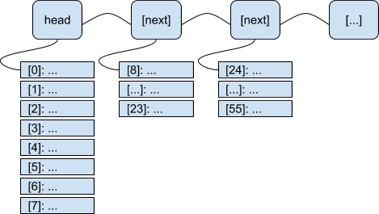

# Dynamic Array #

This repository contains source code implementation of a dynamic array in the
C programming language. The purpose of this array is to extend a very simple
interface which provides reasonable runtime complexity. THIS IS NOT AN ARRAY
LIST.

# API Function Signatures #

### darray_create ###

Create a new instance of a `darray` object and return it.

```
    darray * darray_create(void (*destroy)(void *))
```

Parameters:

- `destroy`: Pointer to a user function. If non-NULL, this function is called
on all non-NULL entries in the array when darray_destroy() is called.

### darray_get ###

Get the user data held in the array `array` at index `index`.

```
    void * darray_get(darray * array, int index)
```

Parameters:

- `array`: Pointer to the user's array.
- `index`: The index to retrieve the user's data from.

### darray_set ###

Set the array element at index `index` to contain the user data held at `data`.

```
    int darray_set(darray * darray, int index, void * data)
```

Parameters:

- `darray`: Pointer to the user's array
- `index`: The index of the element in the array
- `data`: The user's data to populate the array

### darray_destroy ###

Destroy the array pointed to and free all internal memory. If the user called
`darray_create` with a pointer to a function (instead of NULL) that function is
called on ever non-NULL element in the array.

```
    void darray_destroy(darray ** array)
```

Parameters:

- `array`: Address of a pointer to the array. The reason for the indirection is
so that we can set the pointer (*array) to NULL at the end of this call. This
is one way to check for success after the function returns.

# Time Complexity #

```
darray_create: O(1)
darray_get: O(logn), E(1)
darray_set: O(logn), E(1)
darray_destroy: O(n)
```

The functions `darray_get` and `darray_set` have O(logn), however, they are
optimized for linear access. For example, if the user writes a control loop
like the following for the populated dynamic array struct held in the variable
`array`:

```
for (int i = 0; i < darray_largest(array); i++) {
	void * mydata = darray_get(array, i);
	/* Do something with `mydata'... */
}
```

The user will find that all calls to `darray_get`, except for those which
access an index which aligns on a power of two, will run in constant time. This
is provided by the internal architecture of the Dynamic Array structure.

# Architecture #

The internal structure of the Dynamic Array structure is shown in the figure
below. Internally, the array is represented by a linked list, each node
containing a pointer to an array of user data. A linked list was chosen because
it supported constant time insertion. The size of the array pointed to by the
node is proportional to the number of nodes in the list. The size of the first
array is 8, the second is 16, etc. Arrays are dynamically allocated as
necessary.

As an example, say the user has a dynamic array which contains three user
elements, in the positions [0, 1, 2]. Internally, the array will contain a
single node in the list, which contains a pointer to an array of 8--where the
user data can be found. If the user calls `darray_set(myArray, 13, myData)`
with the index of 13, the following events will happen in order:

- `darray_set` will iterate through the linked list, searching for the array
containing indices 8-23.
- `darray_set` will reach the end of the list, signified by a NULL pointer,
then will call an internal function with static linkage named `expand_list`.
- `expand_list` will push a new node onto the tail of the linked list, and
populate it with a pointer to a freshly allocated array of 16 elements
(allocated with `calloc`).
- `darray_set` will then place the user data in the new array at index `[5]`.

The algorithm for `darray_get` is very similar. Certain liberties have been
taken to optimize special cases. If the user wishes to look into specifically
what these minor optimizations are, RTFM. If the user calls `darray_set` with
the largest index (found by `myArray->largest`) and a data field of NULL, and
`myArray->largest` is pushed down to a value in the previous node's array,
`darray_set` will deallocate the node pointed to by the tail of the list. Thus
the array will expand and contract automatically, as necessary. Thus, it is
___dynamic___.


